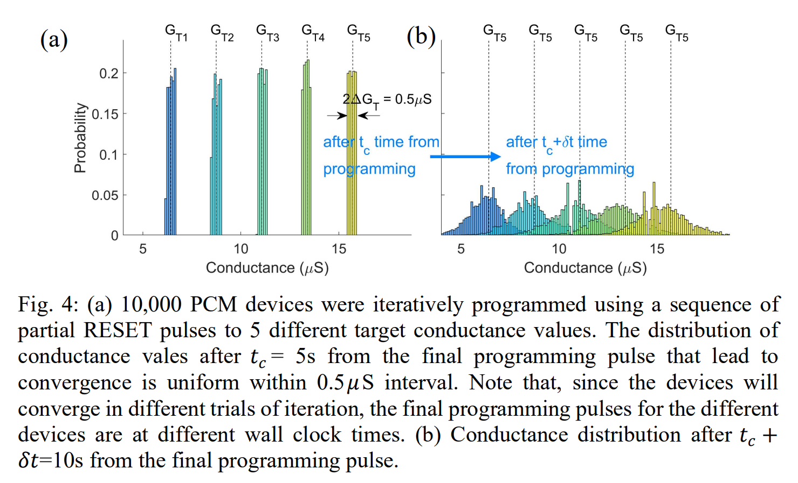

# How are "Weights" Mapped on Analog Tiles?

## PCM techniques
- SET/RESET mechanism*[1]*
    + PCM is actually based on phase change materials, which could change the state between amorphous and crystalline.
    + *RESET*: The procedure of RESET is applying a high voltage to melt the material (from crystalline into amorphous state) and quickly cool down, which could freeze the atomic structure in amorphous state.
    + *SET*: After the cell is amorphized, a voltage which has a lower magnitude but long pulse time is applied to transfer the cell from amorphous state into crystalline state **continuously**.
    
- Application in CIM *[1,2]*
    + Multi-level programming
        + The following paper *[3,4,5,6,7]* consider the conductance of PCM cell to be continuous and unlimited, which means, one could achieve theoretical unlimited weight precision with an addable noise (deviation, Gaussian noise in short term). 
        
        + Physical research propose*[1]* that the highest reliable precision per single cell is no more than 3bit.  
        
    + Bit slicing
        + Several works would apply bit slicing technique to limit the precision of per column in 

## Weight mapping precision
*(All content in this section is summarized from reference 8)*
Though theoretically, the weight mapping on to the PCM tiles could achieve 100% convergence bu applying the closed loop iterative programming (this is a typical method used in PCM weight programming), the conductance could vary with time. 

Actually the programmed weight could be described as
$$G_m(t_c)=G(t_c)+n_G(t_c)$$ 
$t_c$ represents the time from programming to read. In this equation $G(t_c)$ represents the *noise free conductance* and $n_G(t_c)$ represents the *read noise* 

# References
- *All affiliation in those papers is IBM, Mean author is Manuel Le Gallo and Abu Sebastian*
1. [PCM physics] An overview of phase-change memory device physics ()
2. 
3. HERMES Core – A 14nm CMOS and PCM-based In-Memory Compute Core using an array of 300ps/LSB Linearized CCO-based ADCs and local digital processing
4. A Flexible and Fast PyTorch Toolkit for Simulating Training and Inference on Analog Crossbar Arrays
5. Using the IBM analog in-memory hardware acceleration kit for neural network training and inference
6. Fully On-Chip MAC at 14 nm Enabled by Accurate Row-Wise Programming of PCM-Based Weights and Parallel Vector-Transport in Duration-Format
7. Computational memory-based inference and training of deep neural networks
8. Nandakumar S R, Boybat I, Han J P, et al. Precision of synaptic weights programmed in phase-change memory devices for deep learning inference[C]//2020 IEEE International Electron Devices Meeting (IEDM). IEEE, 2020: 29.4. 1-29.4. 4.

* [Previous page](./Basic-theory-and-structures-of-analog-CIM.html)
* [Next page](./How-are-weights-mapped-on-analog-tiles.html)
* [Content](./Introduction.html)
* [Home](../)