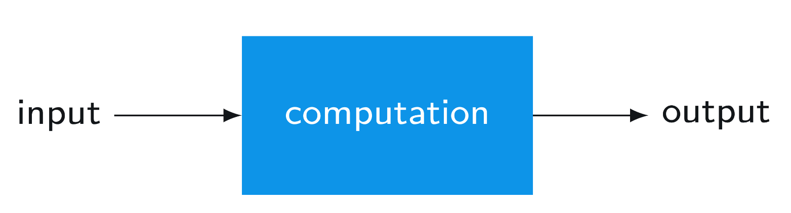

# Query Algorithm

## What context do we need quantum computing
Nowadays, many researches has put their attention on quantum computing. Before the introduction of quantum algorithm, it is important to emphasize the context where we would like to exploit quantum computing.

Actually for most classical computing problems, conventional computing systems could handle them well, both in time, energy, and cost. Compared with conventional memory, quantum memory is expensive. Compared with conventional processor, quantum computing is energy consuming. However, quantum computing is fast in complex problem solving, such as computational chemistry and biology.  Hence, the only advantage we care about in quantum computing is time, which means, quantum computing sacrifice all other properties for time.

## Why start with query algorithm
Query model could be considered as the base of quantum computing developing and it is a simple model to serve as a start.

## The query model of computation

### What is query model?
The key insight is that how the access patterns of the input are different in classical computing and quantum computing.

The processing to solve a problem in classical computing mostly could be described as follows:

- The system has an input and an output. The input is fully exposed to the computation unit. 

